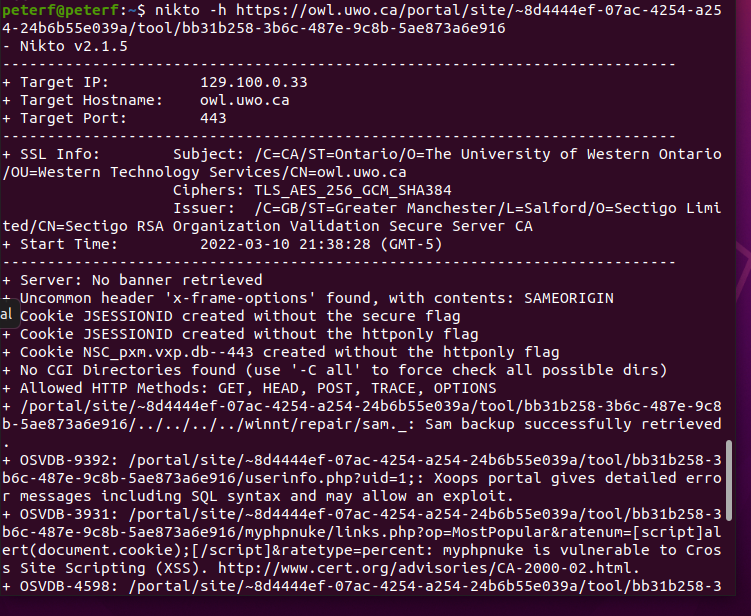

# 1. Background

Websites are a critical part of almost every business or organization in the world. From your nearby florist to global brands, almost everyone uses a website as part of their branding.[^intro_of_Nikto]

Unfortunately, websites are also one of the most unsecured gateways through which an attacker can exploit your company. Since most websites are not backed by strong technical teams, it is important to understand the website and web application security to protect your organization.[^intro_of_Nikto]


# 2. How to avoid it?

**Use the Nikto web scanner.**


## 2.1 What is this tool/method does

Nikto can detect critical vulnerabilities in advance, allowing users to be forewarned.[^intro_of_Nikto]

It can scan the web type of the specified host, hostname, specific directory, cookie, specific CGI vulnerability, XSS vulnerability, SQL injection vulnerability, etc.[^intro_of_Nikto]


## 2.2 How it does it

After the information collected in the penetration testing phase is completed, it is necessary to scan for possible vulnerabilities in the target site based on the collected information including: [^intro_of_Nikto]

* SQL injection vulnerabilities
* cross-site scripting vulnerabilities
* file upload vulnerabilities
* file inclusion vulnerabilities
* command execution vulnerabilities

the operation part will be displayed in Section . 


## 2.3 Who use it or would want to use it

Nikto is a web server scanner that can perform a comprehensive variety of scans on web servers. So any user related to web security is a potential user of nikto, such as web security tester. On the other hand, Nikto can be used by hacker to find vulnerabilities


## 2.4 Why it would be useful?

There is a type of security testing called penetration testing where the tester acts as an attacker to evaluate security the website. Generally, nikto is used for information collection in the early stage of penetration. nikto will collect some information on the server and some possible problems, which will be a great help to the later penetration test.


## 2.5 What is the real-world impact and signigicance?

Nikto can scan over 3300 potentially dangerous files ; over 625 server versions; over 230 specific server issues. Nikto provides efficient and convenient inspection at no cost. It is an excellent tool for web-based protection[^info]


# 3. How to use Nikto

## 3.1 Install

The first thing is we need to install Nikto in the operating system. 

For windows user, the use of Nikto needs to rely on the Active State prel environment, so the Acticve State prel needs to be installed first. 

For Linux user, it will be easy. You can use the following commands to update the system and install the Nikto.[^intall_nikto]

```bash
sudo apt-get update 
sudo apt-get upgrade 
sudo apt-get install nikto -y
```


## 3.2 Function

After we installed the nikto, we can use the following command to check what function does nikto have. 

```bash
nikto -h
```

The result will show as the following figure. 


More information can be found from the nikto repo in the Github  [^nikto_repo]or this website.[^this_website]

Let try one of these. 

```bash
nikto -list-plugins
```

It will list all available plugins which are shown in the following figure.


## 3.3 basic scan

If we just want to do the basic scans of web pages, just use the following command:

```bash
nikto -h url/ip
```

where the "url/ip" can be the URL of the website or the IP address of the website, for example if we want to do a basic scan for the owl page, we can use:

```bash
nikto -h https://owl.uwo.ca/portal/site/~8d4444ef-07ac-4254-a254-24b6b55e039a/tool/bb31b258-3b6c-487e-9c8b-5ae873a6e916
```

or

```bash
nikto -h 129.100.0.33
```

Then the scan will start and the information will be displayed, as the following figure shows. 

The first block shows some information of the website such as IP address, Hostname and the port. the second block shows the SSL information and the third block shows the potential problems of this website. For example, it shows **_the cookie JSESSIONID created without the secure flag and the httponly flag, Xoops portal give detail error messages including SQL suntax and may allow an exploit, and  Web Wiz Forums ver. 7.01 and below is valnerable to Cross Site Scripting(XSS)._**




## 3.4 Assign the specific port and format the output

If we want to assign the specific port and format the output, we can use ```-p``` and ```-o``` in our command:

```bash
nikto -h url/ip -p port -o format
```

For example:

```bash
nikto -h https://owl.uwo.ca/portal/site/~8d4444ef-07ac-4254-a254-24b6b55e039a/tool/bb31b258-3b6c-487e-9c8b-5ae873a6e916 -p 443 -o uwo1.txt
```

The above example shows we assign the port 443 and we format the output in the uwo1.txt file. 


## 3.5 Scan for multiple websites

If we want to scan for multiple websites, we can create a txt file and put the URL of these websites line by line:


Then using this command will let it scan these websites from bottom to the top.

```bash
nikto -h xxxx.txt
```

Where xxxx.txt in our example is 1234.txt. 


## 3.6 Scan with the specific method

The Nikto offer a tuning function which allows us to specific the scan method. The detail can be found in [this website](https://www.mankier.com/1/nikto). 

We can use ```-T number``` in the command to use this function. For example:

```bash
nikto -h https://owl.uwo.ca/portal/site/~8d4444ef-07ac-4254-a254-24b6b55e039a/tool/bb31b258-3b6c-487e-9c8b-5ae873a6e916 -T 35
```

This example shows the result of scanning the owl website with "3. Information Disclosure" and "5. Remote File Retrieval - Inside Web Root". And the processing time of this scan is extremely fast which is just 10 seconds. 


## 3.7 other commands

In addition to the examples we show, the Nikto also offers a lot of functions such as ```-findonly```, ```-ssl```, ```-useproxy``` etc. for different situations. We can choose the appropriate functions to accomplish our task in different situations


# Reference

[^intall_nikto]: https://linuxhint.com/install_nikto_ubuntu/.
[^nikto_repo]: https://github.com/sullo/nikto/wiki.
[^this_website]: https://www.mankier.com/1/nikto.
[^intro_of_Nikto]: https://www.hardcoder.io/web-server-scanning-with-nikto-an-introduction/
[^info]: https://zh.wikipedia.org/wiki/Nikto